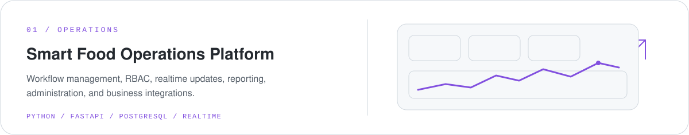
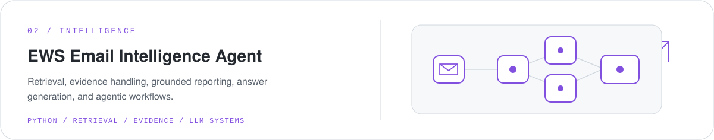
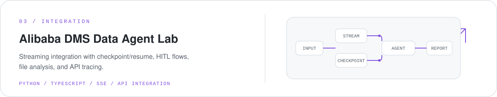
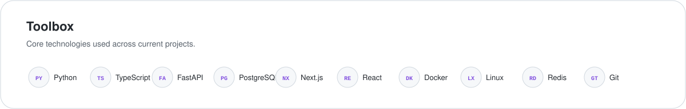

<picture>
  <source media="(prefers-color-scheme: dark)" srcset="./assets/hero-dark.svg">
  <source media="(prefers-color-scheme: light)" srcset="./assets/hero-light.svg">
  
</picture>

Backend systems, workflow automation, data-intensive applications, and applied AI for operational software.

## Projects

<a href="https://github.com/Mohammad-Sobhan-Saririan/smart-food-operations-platform">
  <picture>
    <source media="(prefers-color-scheme: dark)" srcset="./assets/project-1-dark.svg">
    <source media="(prefers-color-scheme: light)" srcset="./assets/project-1-light.svg">
    
  </picture>
</a>

 

<a href="https://github.com/Mohammad-Sobhan-Saririan/ews-email-intelligence-agent">
  <picture>
    <source media="(prefers-color-scheme: dark)" srcset="./assets/project-2-dark.svg">
    <source media="(prefers-color-scheme: light)" srcset="./assets/project-2-light.svg">
    
  </picture>
</a>

 

<a href="https://github.com/Mohammad-Sobhan-Saririan/alibaba-dms-data-agent-lab">
  <picture>
    <source media="(prefers-color-scheme: dark)" srcset="./assets/project-3-dark.svg">
    <source media="(prefers-color-scheme: light)" srcset="./assets/project-3-light.svg">
    
  </picture>
</a>

## Toolbox

<picture>
  <source media="(prefers-color-scheme: dark)" srcset="./assets/toolbox-dark.svg">
  <source media="(prefers-color-scheme: light)" srcset="./assets/toolbox-light.svg">
  
</picture>

## Current focus

Backend architecture · Production AI systems · Integrations & automation

<!--
Add verified public links here when ready, for example:
[LinkedIn](YOUR_LINKEDIN_URL) · [Website](YOUR_WEBSITE_URL) · [Email](mailto:YOUR_EMAIL)
-->
