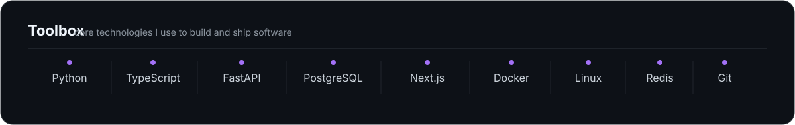

<picture>
  <source media="(prefers-color-scheme: dark)" srcset="./assets/hero-dark.svg">
  <source media="(prefers-color-scheme: light)" srcset="./assets/hero-light.svg">
  
</picture>

I work across backend systems, workflow automation, data-heavy applications, and applied AI, with an emphasis on practical software for real operational workflows.

<picture>
  <source media="(prefers-color-scheme: dark)" srcset="./assets/toolbox-dark.svg">
  <source media="(prefers-color-scheme: light)" srcset="./assets/toolbox-light.svg">
  
</picture>

Software Engineer · Backend Systems · Automation · Data · Applied AI · Product Engineering
