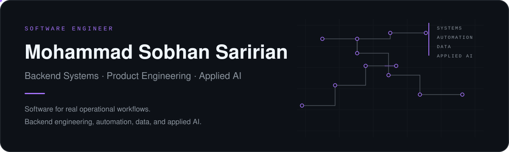

<picture>
  <source media="(prefers-color-scheme: dark)" srcset="./assets/hero-dark.svg">
  <source media="(prefers-color-scheme: light)" srcset="./assets/hero-light.svg">
  
</picture>

 

I design and build software systems where backend engineering, automation, data, and applied AI meet real operational workflows. My work focuses on reliability, clear system boundaries, useful interfaces, and production-minded implementation.

### Selected engineering work

**[Smart Food Operations Platform](https://github.com/Mohammad-Sobhan-Saririan/smart-food-operations-platform)**  
Operational platform for workflow management, RBAC, realtime updates, reporting, administration, and business integrations.  
`Python` `FastAPI` `PostgreSQL` `Realtime Systems`

**[EWS Email Intelligence Agent](https://github.com/Mohammad-Sobhan-Saririan/ews-email-intelligence-agent)**  
Email intelligence system built around retrieval, evidence handling, grounded reporting, answer generation, and agentic workflows.  
`Python` `LLM Systems` `Retrieval` `Evidence Pipelines`

**[Alibaba DMS Data Agent Lab](https://github.com/Mohammad-Sobhan-Saririan/alibaba-dms-data-agent-lab)**  
Integration engineering lab for Alibaba DMS Data Agent APIs, including streaming, checkpoint/resume, HITL flows, file analysis, and API tracing.  
`Python` `API Integration` `SSE` `Agent Systems`

### Engineering profile

| Backend & Systems | AI & Data Systems | Product Engineering |
| --- | --- | --- |
| API architecture | Agentic workflows | End-to-end product flows |
| Realtime & streaming | Retrieval & evidence | Admin and operational tooling |
| Auth, RBAC & data layers | LLM integration | Reporting and automation |
| Reliability & deployment | Grounded generation | Maintainable interfaces |

### Core stack

`Python` · `TypeScript` · `FastAPI` · `Next.js` · `PostgreSQL` · `SQLite` · `Redis` · `Docker` · `Linux` · `REST` · `SSE` · `Git`

### Current focus

Production AI systems, reliable backend architecture, real-world integrations, and software that remains understandable as it grows.

---

Selected repositories below contain the implementation details, architecture notes, screenshots, and setup instructions.
